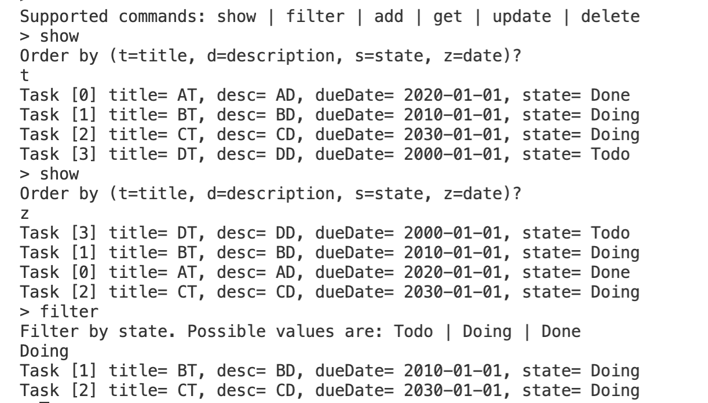

# Lerneinheit 05

Im Package [ch.fhnw.oop2.le](./src/ch/fhnw/oop2/le) finden Sie Code Beispiele aus den Videos.

# Arbeitsblätter (AB)
Die Arbeitsblätter finden Sie direkt auf den Folien. Den Code zu den Aufgaben finden Sie hier: [ch.fhnw.oop2.ab](./src/ch/fhnw/oop2/ab)

# Übungen (UB)

## Tasky Teil 3
In dieser Übung erweitern wir Tasky um eine Filterfunktion. Mit dem Befehl **filter** können wir nach dem Zustand der Tasks filtern. Wenn wir den Befehl aufrufen, dann fragt uns Tasky auf welchen Zustand wir filtern wollen (siehe Screenshot unten).

### Interaktion mit dem CLI (Command Line Interface)
Nachfolgend sehen wir ein Screenshot, wie die Interaktion mit dem CLI etwas aussehen könnte:

### Aufgabe:
1. Ergänzen Sie das `TaskyCLI` so, dass es neu ein **filter** Befehl gibt, der nach dem Filter-Kriterium fragt. Vorerst filtern wir nur nach den Zuständen der Task (Todo, Doing, Done), aber die können die Kriterien beliebig erweitern.
2. Benutzen Sie ein Stream auf der Menge der Tasks, die beim `read()` zurückkommt. Implementieren Sie das filtern auf diesem Stream.